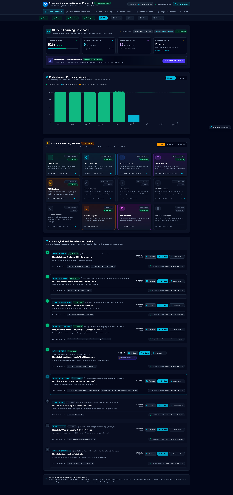
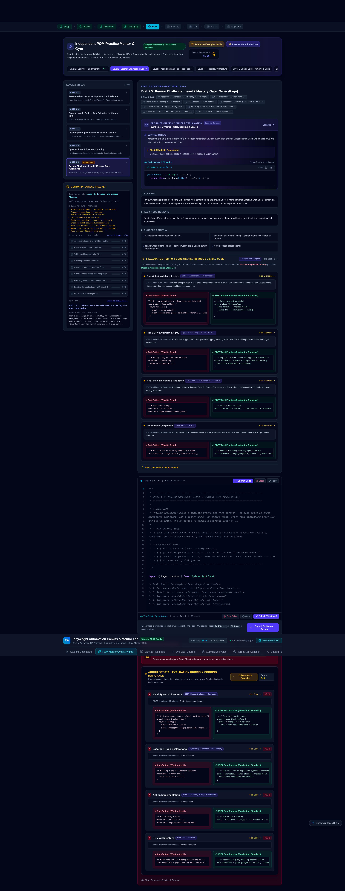
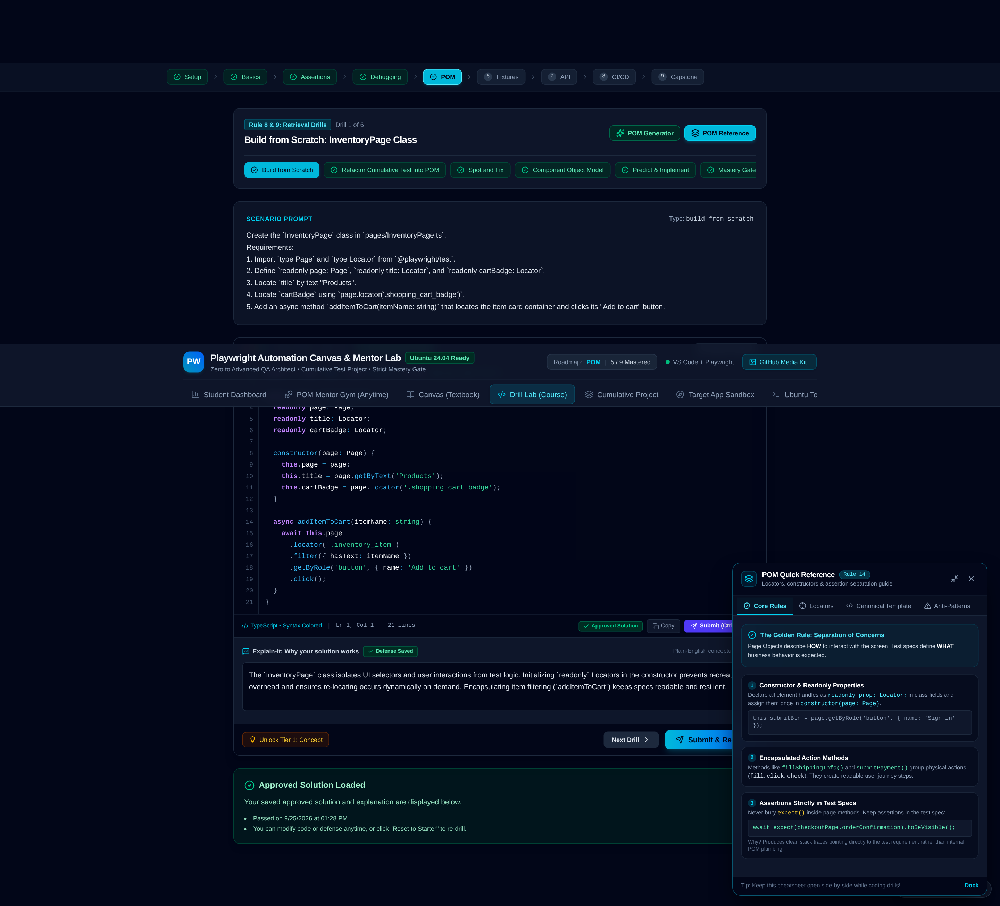
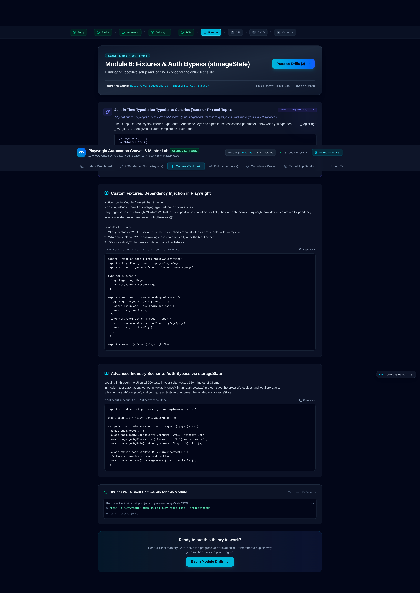
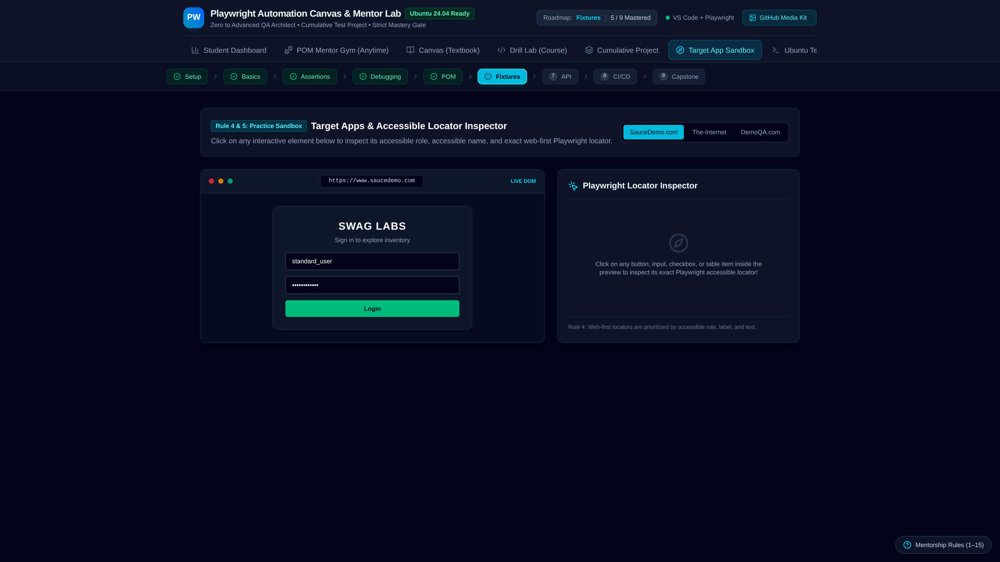
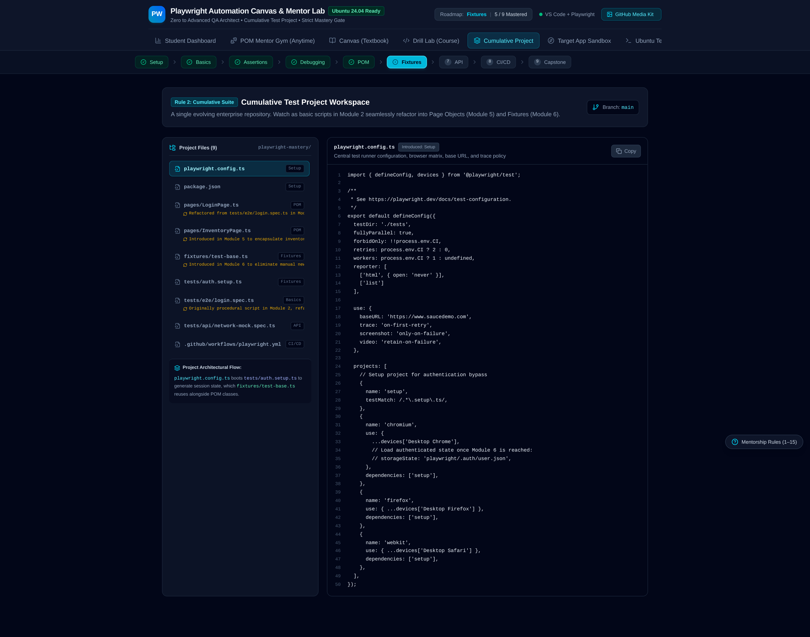

# 🎭 Playwright Automation Canvas & Mentor Lab

[](https://playwright.dev/)
[](https://www.typescriptlang.org/)
[](https://ubuntu.com/)
[](https://react.dev/)
[](https://tailwindcss.com/)
[](https://opensource.org/licenses/MIT)

> **An interactive SDET flight simulator, Page Object Model (POM) architectural gym, and cumulative test framework workbench designed for zero-flakiness modern web automation on Linux (Ubuntu 24.04 LTS).**

---

## 📌 Executive Summary

Most test automation tutorials teach beginners how to record brittle scripts that break the moment a DOM class changes or an element animates into view. In contrast, **Playwright Automation Canvas & Mentor Lab** was engineered to train and evaluate Software Development Engineers in Test (SDETs) and QA Leads against **production-grade enterprise architecture standards**.

This platform combines:
1. **Interactive POM Architecture Gym** — 7 progressive mastery levels featuring 35 distinct architectural coding drills evaluated by real-time static analysis and strict anti-pattern rubrics.
2. **Curriculum Canvas (Textbook)** — Deep technical deep-dives into modern browser engine protocols (CDP/WebSockets), auto-waiting mechanics, web-first assertions, and headless Ubuntu configuration.
3. **Automated Evaluator & Defense Prompts** — Rejects hardcoded sleeps (`page.waitForTimeout`), misplaced assertions inside POMs, and brittle selectors, requiring engineers to articulate architectural justifications.
4. **Target App Sandbox** — A live, embedded multi-scenario testbed application (authentication, dynamic filtered tables, multi-step wizards, asynchronous spinners, dialogs) for locator testing.
5. **Cumulative Production Test Suite** — A multi-file enterprise test repository demonstrating custom test fixtures (`test.extend`), `storageState` session reuse, route virtualization (`page.route`), and GitHub Actions matrix sharding.
6. **Ubuntu 24.04 LTS Companion** — Native Linux system dependency installation guides, Wayland/X11 headless runner tuning, and Playwright CLI tooling.

---

## 📸 Real Application Screenshots

### 📊 1. Full Student Learning Dashboard & Competency Radar
> *Live telemetry showing 9/9 mastered curriculum stages, 100% anti-pattern elimination rate, and the 8-dimension POM Competency Radar chart.*

<p align="center">
  
</p>

### 🏋️ 2. Independent POM Practice Mentor & Gym (Level 2 Complete)
> *Interactive Level 2 ('Locator and Action Fluency') with all 5 drills completed, dynamic `.filter({ hasText })` Page Object code, and passed architectural rubric evaluation.*

<p align="center">
  
</p>

### 🧪 3. POM Drill Lab with POM Quick Reference Open
> *Course Drill Lab for the Page Object Model module featuring interactive code editor, 3-tier hints, test runner, and the side-by-side POM Quick Reference cheat sheet.*

<p align="center">
  
</p>

### 📖 4. Fixtures Module Canvas Textbook
> *Deep-dive textbook lesson on Custom Test Fixtures (`test.extend`), `storageState` session re-use, fixture lifecycle `use()` teardown, and eliminating test flakiness.*

<p align="center">
  
</p>

### 🌐 5. Live Target Application Sandbox & Locator Inspector
> *Full-featured interactive target web app with dynamic filtered tables, multi-step checkout wizard, and Playwright semantic locator inspection badges (Resolution: 2880 × 1620 px).*

<p align="center">
  
</p>

### 📦 6. Cumulative Production Test Suite Explorer
> *Enterprise multi-file test repository demonstrating Page Object Model architecture, custom fixtures (`fixtures/test-base.ts`), `storageState` session bypass, and GitHub Actions CI workflow (Resolution: 2880 × 2264 px).*

<p align="center">
  
</p>

---

## 🚀 Key Modules & Capabilities

```
┌────────────────────────────────────────────────────────────────────────┐
│               PLAYWRIGHT AUTOMATION CANVAS & MENTOR LAB                │
├───────────────────┬───────────────────┬────────────────────────────────┤
│ 🏋️ POM Gym (7 Lvls)│ 📖 Canvas (9 Stgs)│ 🧪 Interactive Drill Lab       │
│ 35 Architecture   │ Zero-to-Advanced  │ AST Antipattern Guardrails     │
│ Drills + Rubrics  │ Linux Engineering │ 3-Tier Progressive Hints       │
├───────────────────┼───────────────────┼────────────────────────────────┤
│ 📦 Cumulative Suite│ 🌐 Target Sandbox │ 🐧 Ubuntu 24.04 Terminal       │
│ Production Fixture│ Live Interactive  │ System Apt Dependencies &      │
│ & POM Architecture│ Enterprise Web App│ Headless CI Pipeline Runner    │
└───────────────────┴───────────────────┴────────────────────────────────┘
```

### 1. 🏋️ POM Architecture Mentor Gym (7 Levels · 35 Drills)
A gamified, rigorous architectural gym dedicated to the Page Object Model and modern test design:
- **Level 1: Beginner Fundamentals (5 Drills)**
  - Readonly locators, constructor initialization with `page`, granular action methods, explicit return types (`Promise<void>`), and strict separation of POM actions from test assertions.
- **Level 2: Locator and Action Fluency (5 Drills)**
  - Accessible locators (`getByRole`, `getByLabel`), parameterized dynamic selectors, container & table row filtering with `.filter({ hasText })`, cell-scoped actions, and collection counts.
- **Level 3: Assertions and Page Transitions (5 Drills)**
  - Fluent method chaining returning subsequent Page Objects, multi-step checkout and wizard orchestration, exposing locators for web-first assertions, and conditional navigation branches.
- **Level 4: Reusable Component Architecture (5 Drills)**
  - Composition over inheritance, extracting root-scoped Component Objects (`root: Locator`), reusable navigation bars, modal dialogs, eliminating bloated `BasePage` god objects.
- **Level 5: Junior-Level Framework Skills (5 Drills)**
  - Custom test fixtures using `test.extend()`, dependency injection for Page Objects, `storageState` authentication bypass, fixture lifecycle (`use()`) teardown, and role-based test environment parametrization.
- **Level 6: Junior-to-Mid-Level Reliability (5 Drills)**
  - Diagnosing race conditions and missing `await` statements, network request interception and mocking with `page.route()`, dynamic spinner synchronization (`waitFor({ state: 'hidden' })`), fault injection (HTTP 500), and eliminating flaky sleeps.
- **Level 7: CI and Enterprise Architecture (5 Drills)**
  - GitHub Actions Ubuntu workflow configuration, headless browser dependency management, failure-only artifact and trace retention (`retain-on-failure`), matrix test sharding (`--shard=1/4`), and Architectural Decision Records (ADRs).

---

### 2. 📖 9-Stage Curriculum Canvas

| Stage | Title | Core Focus |
|---|---|---|
| **01. Setup** | Ubuntu 24.04 Environment | Node.js runtime, `npx playwright install --with-deps`, `playwright.config.ts`, CDP WebSocket pipes |
| **02. Basics** | Modern Playwright Locators | `getByRole`, `getByLabel`, `getByPlaceholder`, auto-waiting actionability checks |
| **03. Assertions** | Web-First Assertions | `expect(locator).toBeVisible()`, dynamic retries, eliminating boolean assertions |
| **04. Debugging** | Flakiness & Diagnostics | Playwright Trace Viewer, UI Mode, VS Code extension, step-through debugging |
| **05. POM** | Page Object Architecture | Encapsulation, action-centric methods, component composition, domain modeling |
| **06. Fixtures** | Custom Test Fixtures | `test.extend()`, automatic login via saved cookies, fixture lifecycle setup/teardown |
| **07. API** | Mocking & Network Testing | `page.route()`, HAR recording, mock payloads, API testing with `request` context |
| **08. CI/CD** | Linux Pipeline Optimization | Headless test execution, GitHub Actions workflows, matrix test sharding, artifact upload |
| **09. Capstone** | Enterprise Architecture | End-to-end resilient test framework defense, ADR documentation, flakiness zero-tolerance |

---

### 3. 🧪 Antipattern Detection & Guardrail Engine

The built-in evaluation engine statically validates submitted solutions and provides immediate feedback on common bad practices:
- ❌ **Forbidden `page.waitForTimeout()`**: Automatically flagged. Teaches dynamic auto-waiting and web-first state assertions instead of arbitrary sleeps.
- ❌ **Assertions inside POM Classes**: Flagged. Reminds engineers that Page Objects expose services and locators; assertions belong in test specifications (`*.spec.ts`) for clear failure diagnostics.
- ❌ **Brittle CSS / XPath Selectors**: Detects overly tied class chains (`div.content > ul > li:nth-child(2)`) and guides the user toward accessible semantic locators (`getByRole('listitem')`).
- ❌ **Missing `await` Calls**: Catches unawaited promises on locator actions and assertions before they cause silent race conditions.
- 💡 **Mandatory Defense Prompts**: Requires learners to justify *why* their implementation is robust against DOM mutations and asynchronous state delays.

---

## 🛠️ Tech Stack & Architecture

- **Frontend Core**: React 19, TypeScript 5, Vite 6
- **Styling**: Tailwind CSS v4 (with `@tailwindcss/vite`)
- **Interactive Code Workspace**: `react-simple-code-editor` with custom PrismJS syntax highlighting
- **Visualizations & Telemetry**: Recharts (Skill Radar, Mastery Bar charts), Lucide React
- **Motion & Micro-interactions**: Motion (Framer Motion v12)
- **Target OS Foundation**: Linux (Ubuntu 24.04 LTS Noble Numbat)

---

## 📁 Repository Directory Structure

```
playwright-mentor-lab/
├── .github/
│   └── workflows/
│       └── playwright.yml         # Ubuntu 24.04 matrix sharding CI workflow
├── src/
│   ├── components/
│   │   ├── CanvasLesson.tsx       # 9-stage interactive textbook renderer
│   │   ├── CodeEditor.tsx         # In-browser syntax-highlighted code editor
│   │   ├── CumulativeProjectExplorer.tsx # Multi-file production test suite viewer
│   │   ├── Header.tsx             # Global navigation bar & module progress
│   │   ├── InteractiveDrillLab.tsx# Core drill runner with hints and validation
│   │   ├── POMQuickReference.tsx  # Cheat sheet for locators, fixtures & methods
│   │   ├── POMTemplateGeneratorModal.tsx # Scaffold POM & fixture templates
│   │   ├── PomMentorArena.tsx     # 7-Level / 35-Drill POM gym & rubrics
│   │   ├── RoadmapNav.tsx         # Interactive roadmap stage selector
│   │   ├── RuleGuideModal.tsx     # The "Golden Rules of Playwright" modal
│   │   ├── StudentDashboard.tsx   # Visual progress, skills radar, review queue
│   │   ├── TargetAppSandbox.tsx   # Live embedded target web application
│   │   └── UbuntuTerminalCompanion.tsx # Linux command companion & CLI guides
│   ├── data/
│   │   ├── curriculumData.ts      # Comprehensive 9-stage textbook content
│   │   ├── drillExplanations.ts   # Authentic engineering defenses per drill
│   │   ├── pomMentorData.ts       # 35 POM drills, starter code, solutions, rubrics
│   │   └── pomRubrics.ts          # Evaluation rubrics and architectural standards
│   ├── types.ts                   # Domain TypeScript definitions
│   ├── App.tsx                    # Root state coordinator & localStorage sync
│   ├── main.tsx                   # React root mount
│   └── index.css                  # Global Tailwind v4 styles
├── package.json
├── tsconfig.json
├── vite.config.ts
└── README.md
```

---

## ⚡ Quickstart Guide

### Prerequisites
- **Node.js**: v20.x or v22.x LTS
- **Package Manager**: `npm`, `pnpm`, or `bun`
- **Operating System**: Linux (Ubuntu 22.04/24.04 recommended), macOS, or Windows (WSL2 recommended)

### 1. Clone the Repository
```bash
git clone https://github.com/YOUR_USERNAME/playwright-mentor-lab.git
cd playwright-mentor-lab
```

### 2. Install Dependencies
```bash
npm install
```

### 3. Launch the Development Server
```bash
npm run dev
```
Open your browser at `http://localhost:3000` to access the interactive lab.

### 4. Build for Production
```bash
npm run build
npm run preview
```

---

## 🐧 Ubuntu 24.04 LTS Production Playwright Guide

When testing web applications on Linux or running CI in GitHub Actions Ubuntu runners, Playwright requires specific OS-level shared libraries.

### System Dependencies Installation
```bash
# Update Ubuntu package index
sudo apt update

# Install all Playwright browser binaries along with required Ubuntu system libraries
npx playwright install --with-deps
```

### Headless Verification
```bash
# Run test suite across all headless browsers (Chromium, Firefox, WebKit)
npx playwright test

# Run tests with HTML report generation
npx playwright test --reporter=html

# View interactive HTML report
npx playwright show-report
```

### Inspecting Traces on Failure
```bash
# View detailed action trace, DOM snapshots, network waterfall, and console logs
npx playwright show-trace test-results/trace.zip
```

---

## 🏛️ Production Framework Snippet (What Learners Build)

Here is a sample of the architecture taught inside the lab:

### 1. Component-Based Page Object (`src/pages/checkout.page.ts`)
```typescript
import { Page, Locator } from '@playwright/test';
import { CartBadgeComponent } from '../components/cart-badge.component';

export class CheckoutPage {
  readonly page: Page;
  readonly cartBadge: CartBadgeComponent;
  readonly firstNameInput: Locator;
  readonly lastNameInput: Locator;
  readonly postalCodeInput: Locator;
  readonly continueButton: Locator;
  readonly errorMessage: Locator;

  constructor(page: Page) {
    this.page = page;
    this.cartBadge = new CartBadgeComponent(page.getByTestId('cart-header'));
    this.firstNameInput = page.getByLabel('First Name');
    this.lastNameInput = page.getByLabel('Last Name');
    this.postalCodeInput = page.getByLabel('Zip/Postal Code');
    this.continueButton = page.getByRole('button', { name: 'Continue' });
    this.errorMessage = page.getByRole('alert');
  }

  async fillShippingDetails(first: string, last: string, zip: string): Promise<void> {
    await this.firstNameInput.fill(first);
    await this.lastNameInput.fill(last);
    await this.postalCodeInput.fill(zip);
  }

  async submitShipping(): Promise<void> {
    await this.continueButton.click();
  }
}
```

### 2. Custom Fixtures with Session Authentication (`src/fixtures/test.fixture.ts`)
```typescript
import { test as baseTest, expect } from '@playwright/test';
import { CheckoutPage } from '../pages/checkout.page';

type TestFixtures = {
  checkoutPage: CheckoutPage;
};

export const test = baseTest.extend<TestFixtures>({
  checkoutPage: async ({ page }, use) => {
    const checkoutPage = new CheckoutPage(page);
    await page.goto('/checkout');
    await use(checkoutPage);
    // Automatic teardown logic runs here if needed
  },
});

export { expect };
```

### 3. Clean, Web-First Test Spec (`tests/checkout.spec.ts`)
```typescript
import { test, expect } from '../src/fixtures/test.fixture';

test.describe('E-Commerce Checkout Flow', () => {
  test('displays validation error when shipping postal code is missing', async ({ checkoutPage }) => {
    await checkoutPage.fillShippingDetails('Jane', 'Doe', '');
    await checkoutPage.submitShipping();

    // Assertions remain exclusively inside the test specification
    await expect(checkoutPage.errorMessage).toBeVisible();
    await expect(checkoutPage.errorMessage).toContainText('Postal Code is required');
  });
});
```

---

## 📄 License

Distributed under the **MIT License**. See `LICENSE` for more information.

---

<p align="center">
  Built with ❤️ for SDETs, Automation Architects, and Quality Engineers everywhere.
</p>
